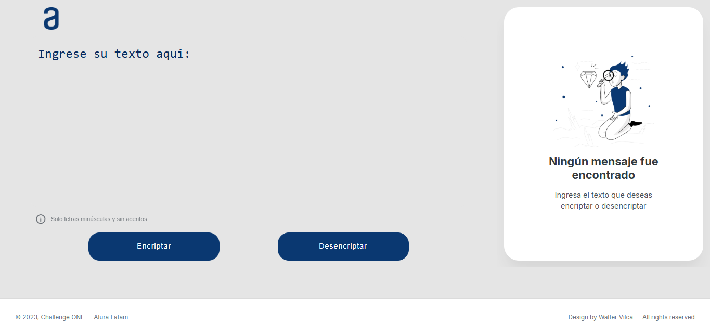

# Conversor de Texto — Challenge ONE

Aplicación web para encriptar y desencriptar mensajes de texto, desarrollada como parte del programa Oracle Next Education (ONE) en colaboración con Alura Latam.

---

## Demo



---

## ¿Cómo funciona?

La app aplica un sistema de sustitución de vocales:

| Letra | Cifrado |
| ----- | ------- |
| `e`   | `enter` |
| `i`   | `imes`  |
| `o`   | `ober`  |
| `a`   | `ai`    |
| `u`   | `ufat`  |

**Ejemplo:**

```
gato  →  gaitober
hola  →  hoberlai
```

El texto ingresado se convierte en tiempo real mientras escribes.

---

## Uso

1. Selecciona el modo **Encriptar** o **Desencriptar**.
2. Escribe tu mensaje en el panel izquierdo.
   - Solo letras minúsculas y espacios. Los acentos se normalizan automáticamente.
3. El resultado aparece en el panel derecho al instante.
4. Usa el botón **Copiar** para llevarte el resultado al portapapeles.

---

## Estructura del proyecto

```
conversor/
│   index.html
│   README.md
│
├── src/
│   ├── css/
│   │   ├── main.css
│   │   └── responsive.css
│   │
│   └── js/
│       ├── app.js
│       ├── converter.js
│       └── ui.js
│
└── assets/
    ├── icons/
    │   └── favicon.ico
    └── images/
        ├── logo.png
        └── person.png
```

---

## Tecnologías

- HTML5 semántico
- CSS3
- JavaScript
- Material Symbols — íconos
- clipboard-polyfill — fallback para Clipboard API

---

## Créditos

- **Programa:** [Oracle Next Education — ONE](https://www.oracle.com/ar/education/oracle-next-education/)
- **Desarrollador:** [Walter Vilca](https://app.aluracursos.com/user/samuelwalter2001)
